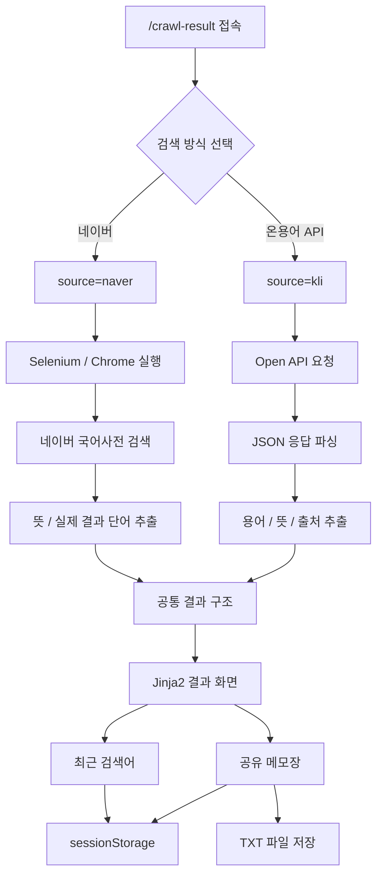

# 사전 검색 기능

기존 Selenium 기반 네이버 국어사전 크롤링 기능을 유지하면서,
국립국어원 언어정보나눔터 · 온용어 Open API 검색 방식을 추가한 사전 검색 기능입니다.

사용자는 검색 방식을 선택할 수 있으며,
두 검색 방식은 서로 다른 검색 로직을 사용하지만 최근 검색어와 메모는 함께 공유합니다.

---

<details>
<summary><strong>요약보기</strong></summary>

## 기능 개요

Flask + Jinja2 기반 웹 화면에서 다음 두 가지 방식으로 단어를 검색합니다.

- 네이버 국어사전: Selenium 동적 크롤링
- 언어정보나눔터 · 온용어: Open API

검색 방식은 분리되어 있지만 최근 검색어와 메모장은 같은 `sessionStorage` 데이터를 사용합니다.

---

## 주요 기능

- Selenium 기반 네이버 국어사전 검색
- 국립국어원 언어정보나눔터 · 온용어 Open API 검색
- 검색 방식 선택 화면
- 검색 방식별 제목 / 설명 / 출처 표시
- 검색 결과 뜻 자동 추출
- 입력 검색어와 실제 결과 단어 비교
- 검색 결과 없음 `NO_RESULTS` 처리
- 뜻별 결과 카드 표시
- 검색 중 로딩 화면
- 오류 유형별 안내 및 유지보수 로그
- 최근 검색어 최대 5개 관리
- Selenium / API 간 최근 검색어 공유
- 검색 결과 메모
- Selenium / API 간 메모 공유
- 메모별 출처 저장
- 모든 뜻 한 번에 메모
- 메모 개별 삭제 / 전체 초기화
- 메모 TXT 파일 저장

---

## 사용 기술

### Backend

- Python
- Flask
- Jinja2

### Crawling

- Selenium
- Chrome
- ChromeDriver

### Open API

- 국립국어원 언어정보나눔터 · 온용어 Open API
- `urllib`
- `python-dotenv`
- Environment Variables

### Frontend

- HTML
- CSS
- JavaScript
- `sessionStorage`

---

## 주요 파일

```text
crawler/
├─ __init__.py
└─ crawler.py

templates/
└─ crawl_result.html
```

| 파일 | 역할 |
| --- | --- |
| `crawler/crawler.py` | Selenium 검색, Open API 검색, 결과 파싱, 오류 처리 |
| `templates/crawl_result.html` | 검색 방식 선택, 검색창, 결과 카드, 로딩, 오류, 최근 검색어, 메모 UI |

---

## 검색 구조

```text
/crawl-result
      ↓
검색 방식 선택
      ↓
┌──────────────────────┬──────────────────────────┐
│ 네이버 국어사전      │ 언어정보나눔터 · 온용어 │
│ Selenium             │ Open API                 │
└──────────┬───────────┴─────────────┬────────────┘
           ↓                         ↓
      source=naver               source=kli
           ↓                         ↓
      Chrome 실행                  API 요청
           ↓                         ↓
      동적 크롤링                 JSON 파싱
           └─────────────┬───────────┘
                         ↓
                    결과 화면 출력
                         ↓
              최근 검색어 / 메모 공유
```

---

## 검색 URL

검색 방식 선택:

```text
/crawl-result
```

네이버 Selenium:

```text
/crawl-result?source=naver
```

온용어 Open API:

```text
/crawl-result?source=kli
```

검색어 포함:

```text
/crawl-result?source=naver&keyword=사출
```

```text
/crawl-result?source=kli&keyword=사출
```

---

## 최근 검색어 / 메모 공유

```javascript
const RECENT_SEARCH_KEY = "crawl_recent_searches";
const MEMO_KEY = "crawl_dictionary_memos";
```

두 검색 방식에서 같은 Key를 사용하므로,
검색 방식을 변경해도 최근 검색어와 메모가 유지됩니다.

---

## 환경 변수

프로젝트 루트의 `.env`:

```env
KLI_API_KEY="발급받은_API_KEY"
```

`.gitignore`:

```text
.env
```

배포 환경에서는 Vercel Environment Variables에 다음 값을 등록합니다.

```text
KLI_API_KEY
```

---

## 실행 방법

```bash
python -m venv .venv
.venv\Scripts\activate
pip install -r requirements.txt
python app.py
```

브라우저:

```text
http://localhost:5000/crawl-result
```

</details>

---

<details>
<summary><strong>자세히 보기</strong></summary>

## 1. 기능 개요

기존 기능은 Selenium을 이용해 네이버 국어사전의 실제 검색 화면을 자동으로 조작하고,
검색 결과에서 단어와 뜻을 추출하는 구조입니다.

로컬에서는 정상적으로 작동하지만 Selenium은 Chrome과 WebDriver 실행 환경에 의존합니다.
따라서 배포 환경에서도 사전 검색 기능을 사용할 수 있도록
기존 Selenium 기능을 유지하면서 국립국어원 언어정보나눔터 · 온용어 Open API 검색 방식을 추가했습니다.

현재는 다음 두 가지 검색 방식을 제공합니다.

### 네이버 국어사전

```text
Selenium
→ Chrome 실행
→ 네이버 국어사전 접속
→ 검색어 입력
→ 동적 결과 로딩
→ 뜻 및 실제 결과 단어 추출
```

### 언어정보나눔터 · 온용어

```text
Open API
→ 검색어 전달
→ JSON 응답 수신
→ 결과 파싱
→ 용어 / 뜻 / 출처 추출
```

---

## 2. 검색 방식 선택

사용자가 `/crawl-result`에 처음 접속하면 검색 방식을 선택합니다.

```text
[ 네이버 국어사전 ]
Selenium 동적 크롤링
[ 크롤링 검색 창으로 이동 ]

[ 언어정보나눔터 · 온용어 ]
Open API
[ API 검색 창으로 이동 ]
```

선택한 방식에 따라 같은 `crawl_result.html`에서
제목, 설명, 출처와 실제 검색 로직이 변경됩니다.

---

## 3. 검색 모드 구분

검색 방식은 `source` Query Parameter를 사용해 구분합니다.

```text
source=naver
source=kli
```

예:

```text
/crawl-result?source=naver&keyword=사출
```

```text
/crawl-result?source=kli&keyword=사출
```

`crawler.py`에서는 다음과 같이 분기합니다.

```python
if source == "naver":
    return get_naver_results(keyword)

if source == "kli":
    return get_kli_results(keyword)
```

---

## 4. Selenium 검색

### Chrome Driver

```python
driver = webdriver.Chrome(
    options=options
)
```

기본적으로 Headless 모드를 사용합니다.

```python
options.add_argument(
    "--headless=new"
)
```

### 네이버 국어사전 접속

```python
NAVER_DICT_URL = "https://ko.dict.naver.com/#/main"
```

검색 입력창:

```python
SEARCH_XPATH = '//*[@id="ac_input"]'
```

검색 실행:

```python
search_box.clear()
search_box.send_keys(keyword)
search_box.send_keys(Keys.ENTER)
```

---

## 5. Selenium 뜻 추출

뜻 영역:

```python
MEAN_SELECTOR = 'p.mean[lang="ko"]'
```

```python
mean_elements = driver.find_elements(
    By.CSS_SELECTOR,
    MEAN_SELECTOR,
)
```

다음 항목은 제외합니다.

- 빈 텍스트
- 읽을 수 없는 요소
- 중복된 뜻

뜻 하나마다 별도의 결과 카드로 표시합니다.

---

## 6. 실제 결과 단어 확인

입력 검색어와 네이버가 실제로 표시하는 결과 단어가 다를 수 있으므로
결과 단어를 별도로 확인합니다.

예:

```text
입력 검색어: 사추
실제 결과: 사출
```

두 값이 다르더라도 뜻 데이터는 유지하고 경고를 표시합니다.

```text
검색어와 실제 검색 결과 단어가 다릅니다.

입력 검색어: 사추
네이버 국어사전 결과: 사출
```

실제 결과 단어를 읽지 못했지만 뜻 데이터가 존재하면
입력 검색어를 결과 제목으로 사용합니다.

---

## 7. 추가 결과 처리

추가 뜻이 있는 경우 `단어 더보기` 버튼을 확인합니다.

```python
MORE_BUTTON_XPATH = '//*[@id="searchPage_word_more"]'
```

일반 클릭이 실패하면 JavaScript 클릭을 시도합니다.

```python
driver.execute_script(
    "arguments[0].click();",
    more_button,
)
```

추가 결과가 로딩되면 뜻 목록을 다시 읽습니다.

---

## 8. 온용어 Open API

Open API 검색은 Chrome과 Selenium을 실행하지 않습니다.

API Key:

```python
api_key = os.getenv(
    "KLI_API_KEY",
    "",
).strip()
```

요청 Parameter:

```python
params = {
    "key": api_key,
    "apiSearchWord": keyword,
    "start": "1",
    "num": "100",
    "sort": "wt",
}
```

API 응답에서 용어, 정의와 출처 정보를 읽어
화면에서 사용할 공통 결과 구조로 변환합니다.

---

## 9. 검색 결과 없음 처리

검색 결과가 없는 상황은 시스템 오류와 구분합니다.

```text
NO_RESULTS

검색 결과 없음

'검색어'에 대한 검색 결과를 찾지 못했습니다.

확인해볼 내용
검색어의 철자와 띄어쓰기를 확인하거나
다른 단어로 검색해주세요.
```

이를 통해 단순히 검색 결과가 없는 경우와
실제 시스템 장애를 구분합니다.

---

## 10. 데이터 출처 표시

### 네이버 Selenium

```text
출처 · 네이버 국어사전
방식 · Selenium 동적 크롤링
```

### 온용어 Open API

```text
출처 · 국립국어원 언어정보나눔터 · 온용어
방식 · Open API
```

메모에도 검색 결과의 실제 출처를 함께 저장합니다.

---

## 11. 검색 중 로딩 화면

검색 시작 시 다음 상태를 적용합니다.

- Spinner 표시
- 검색 버튼 비활성화
- 버튼 문구 `검색 중...`
- 현재 검색 방식 표시

검색이 완료되면 다시 원래 상태로 복원합니다.

---

## 12. 최근 검색어

최근 검색어는 `sessionStorage`에 최대 5개까지 저장합니다.

지원 기능:

- 최대 5개 저장
- 동일 검색어 중복 방지
- 재검색한 단어를 가장 앞으로 이동
- 클릭 시 재검색
- 개별 삭제
- 전체 삭제

공통 Key:

```javascript
const RECENT_SEARCH_KEY =
    "crawl_recent_searches";
```

따라서 네이버에서 검색한 단어를
온용어 API 화면으로 이동한 뒤에도 확인할 수 있습니다.

---

## 13. 공유 메모장

메모에는 다음 정보를 저장합니다.

- 결과 단어
- 뜻
- 출처
- 저장 시간

공통 Key:

```javascript
const MEMO_KEY =
    "crawl_dictionary_memos";
```

예:

```text
자동차

뜻: ...
출처: 네이버 국어사전 · Selenium 동적 크롤링
```

```text
인공지능

뜻: ...
출처: 국립국어원 언어정보나눔터 · 온용어
```

검색 방식은 분리되어 있지만 메모장은 하나로 공유됩니다.

---

## 14. 중복 메모 방지

같은 단어, 뜻과 출처가 이미 저장되어 있으면 다시 추가하지 않습니다.

```text
단어
+
뜻
+
출처
    ↓
중복 확인
    ↓
이미 존재하면 저장하지 않음
```

---

## 15. 모든 뜻 메모 추가

```text
모든 뜻 메모에 추가
```

현재 검색 결과 중 아직 저장되지 않은 뜻만 메모에 추가합니다.

---

## 16. 메모 삭제 및 초기화

개별 삭제:

```text
×
```

전체 삭제:

```text
메모 초기화
```

전체 삭제 전에는 확인창을 표시합니다.

---

## 17. 메모 TXT 저장

현재 메모를 TXT 파일로 저장할 수 있습니다.

예:

```text
사전 검색 공유 메모
========================================

1. 자동차
뜻: ...
출처: 네이버 국어사전 · Selenium 동적 크롤링
저장일시: ...
----------------------------------------

2. 인공지능
뜻: ...
출처: 국립국어원 언어정보나눔터 · 온용어
저장일시: ...
----------------------------------------
```

별도의 Flask 저장 Route 없이 브라우저에 저장된 메모 데이터로 파일을 생성합니다.

---

## 18. 오류 처리

### Selenium 관련 오류

| 오류 코드 | 설명 |
| --- | --- |
| `EMPTY_KEYWORD` | 검색어가 입력되지 않은 경우 |
| `DRIVER_START_FAILED` | Chrome 실행 실패 |
| `SITE_CONNECTION_FAILED` | 네이버 국어사전 접속 실패 |
| `SEARCH_BOX_NOT_FOUND` | 검색 입력창 탐색 실패 |
| `SEARCH_INPUT_FAILED` | 검색 실행 실패 |
| `ACCESS_BLOCKED` | 자동화 접근 제한 |
| `NO_RESULTS` | 검색 결과 없음 |
| `RESULT_LOAD_TIMEOUT` | 검색 결과 로딩 시간 초과 |
| `DOM_READ_FAILED` | 검색 결과 HTML 요소 읽기 실패 |
| `MEANING_NOT_FOUND` | 뜻 영역 탐색 실패 |
| `BROWSER_COMMUNICATION_FAILED` | Selenium / Chrome 통신 오류 |
| `UNEXPECTED_ERROR` | 분류되지 않은 기타 예외 |

### Open API 관련 오류

- API Key 누락
- API 인증 오류
- HTTP 요청 실패
- 네트워크 연결 실패
- 잘못된 API 응답
- 검색 결과 없음
- 분류되지 않은 예외

사용자 화면에는 오류 코드와 해결 방향을 표시하고,
상세 예외는 서버 로그에서 확인합니다.

---

## 19. 부분 실패 처리

정상적인 뜻 데이터를 이미 확보한 경우,
부가 기능 일부가 실패해도 전체 결과를 제거하지 않습니다.

예:

- 실제 결과 단어 확인 실패
- `단어 더보기` 클릭 실패
- 추가 결과 로딩 시간 초과

```text
검색 결과 확보
    +
일부 부가 기능 실패
    ↓
검색 결과 유지
    +
경고 표시
```

---

## 20. 결과 데이터 구조

정상 결과:

```python
{
    "status": "ok",
    "input_keyword": "사출",
    "title": "사출",
    "url": "검색 결과 또는 출처 URL",
    "meanings": [
        "첫 번째 뜻",
        "두 번째 뜻"
    ],
    "count": 2,
    "word_detected": True,
    "mismatch": False,
    "warnings": [],
    "source_name": "검색 출처",
    "source_method": "검색 방식"
}
```

오류 결과:

```python
{
    "status": "error",
    "error": {
        "code": "NO_RESULTS",
        "title": "검색 결과 없음",
        "message": "'검색어'에 대한 검색 결과를 찾지 못했습니다.",
        "hint": "다른 단어로 검색해주세요."
    }
}
```

---

## 21. API Key 설정

### 로컬

`.env`:

```env
KLI_API_KEY="발급받은_API_KEY"
```

`.gitignore`:

```text
.env
```

### Vercel

Environment Variables:

```text
Name
KLI_API_KEY

Value
발급받은 실제 API Key
```

API Key를 Python 코드에 직접 작성하거나 GitHub에 업로드하지 않습니다.

---

## 22. 실행 방법

가상환경 생성:

```bash
python -m venv .venv
```

가상환경 활성화:

```bash
.venv\Scripts\activate
```

패키지 설치:

```bash
pip install -r requirements.txt
```

Flask 실행:

```bash
python app.py
```

검색 화면:

```text
http://localhost:5000/crawl-result
```

---

## 23. 사용 방법

1. `/crawl-result` 화면에 접속합니다.
2. 네이버 Selenium 또는 온용어 Open API 중 검색 방식을 선택합니다.
3. 검색어를 입력합니다.
4. `검색` 버튼을 클릭합니다.
5. 검색 결과와 데이터 출처를 확인합니다.
6. 필요한 뜻을 메모에 추가합니다.
7. 다른 검색 방식으로 이동해도 최근 검색어와 메모는 유지됩니다.
8. 필요한 메모는 TXT 파일로 저장합니다.

---

## 24. 주의사항

### Selenium 실행 환경

Selenium은 Chrome과 WebDriver 실행 환경에 영향을 받습니다.

로컬에서 정상 작동하더라도 배포 플랫폼에서는 Chrome 실행이 제한될 수 있습니다.

### 네이버 페이지 구조

다음 Selector는 네이버 국어사전 HTML 구조에 의존합니다.

```python
SEARCH_XPATH = '//*[@id="ac_input"]'
MORE_BUTTON_XPATH = '//*[@id="searchPage_word_more"]'
MEAN_SELECTOR = 'p.mean[lang="ko"]'
```

페이지 구조가 변경되면 수정이 필요할 수 있습니다.

### Open API

Open API를 사용하려면 유효한 `KLI_API_KEY`가 필요합니다.

### 최근 검색어 / 메모

최근 검색어와 메모는 `sessionStorage`에 저장되므로
브라우저 세션이 종료되면 초기화됩니다.

필요한 메모는 TXT 파일로 저장합니다.

---

## 전체 흐름



---

## 최종 요약

```text
검색 방식 선택
        ↓
┌─────────────────┬─────────────────────┐
│ Selenium        │ Open API            │
│ 네이버 국어사전 │ 언어정보나눔터      │
└────────┬────────┴──────────┬──────────┘
         ↓                   ↓
     동적 크롤링          API 요청
         ↓                   ↓
         └────────┬──────────┘
                  ↓
             검색 결과
                  ↓
          출처 정보 표시
                  ↓
      최근 검색어 / 공유 메모
                  ↓
              TXT 저장
```

검색 기술은 서로 독립적으로 유지하면서,
사용자가 사용하는 최근 검색어와 메모는 하나의 작업 흐름으로 연결했습니다.

</details>

---

## 실행 방법

```bash
python -m venv .venv
.venv\Scripts\activate
pip install -r requirements.txt
python app.py
```

브라우저에서:

```text
http://localhost:5000/crawl-result
```

로 접속한 뒤 사용할 검색 방식을 선택합니다.
