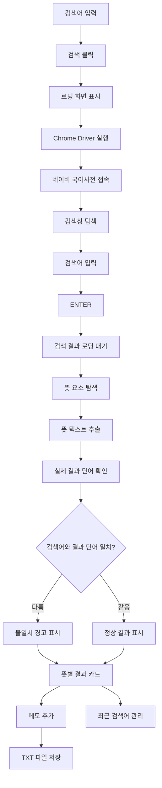

# 네이버 국어사전 크롤링


<details>
<summary>요약보기</summary>

````
# 네이버 국어사전 크롤링 기능

Flask + Jinja2 웹 화면에서 검색어를 입력하면 Selenium으로 네이버 국어사전을 검색하고, 검색 결과의 단어와 뜻을 가져와 표시하는 기능입니다.

검색뿐 아니라 로딩 상태, 검색어 검증, 오류 처리, 최근 검색어, 메모 및 TXT 저장 기능을 함께 제공합니다.

---

# 주요 기능

- Selenium 기반 네이버 국어사전 검색
- 검색 결과 뜻 자동 추출
- 입력 검색어와 실제 결과 단어 비교
- 뜻별 결과 카드 표시
- 네이버 국어사전 원문 링크 제공
- 검색 중 로딩 화면
- 오류 유형별 안내 및 유지보수 로그
- 최근 검색어 최대 5개 관리
- 검색 결과 메모 및 중복 저장 방지
- 전체 뜻 한 번에 메모
- 메모 개별/전체 삭제
- 메모 TXT 파일 저장

---

# 사용 기술

## Backend

- Python
- Flask
- Jinja2

## Crawling

- Selenium
- Chrome
- ChromeDriver

## Frontend

- HTML
- CSS
- JavaScript
- `sessionStorage`

React나 Vue 같은 별도 프론트엔드 프레임워크 없이 Jinja2와 JavaScript로 화면을 구성합니다.

---

# 주요 파일

```text
crawler/
├─ __init__.py
└─ crawler.py

templates/
└─ crawl_result.html
````

| 파일                            | 역할                                        |
| ----------------------------- | ----------------------------------------- |
| `crawler/crawler.py`          | Selenium 실행, 사전 검색, 뜻 추출, 결과 단어 확인, 오류 처리 |
| `templates/crawl_result.html` | 검색창, 결과 카드, 로딩, 오류, 최근 검색어, 메모 UI         |

---

# 검색 흐름

```text
검색어 입력
    ↓
검색 버튼 클릭
    ↓
로딩 화면 표시
    ↓
Chrome Driver 실행
    ↓
네이버 국어사전 접속
    ↓
검색어 입력 및 ENTER
    ↓
검색 결과 로딩 대기
    ↓
뜻 추출
    ↓
실제 결과 단어 확인
    ↓
검색어와 결과 비교
    ↓
Flask 결과 반환
    ↓
Jinja2 화면 출력
```

검색 화면은 다음 경로를 사용합니다.

```text
/crawl-result?keyword=검색어
```

---

# Selenium 검색 구현

Chrome WebDriver를 실행하며 기본적으로 Headless 모드를 사용합니다.

```python
driver = webdriver.Chrome(options=options)
options.add_argument("--headless=new")
```

네이버 국어사전에 접속한 뒤 검색창을 찾습니다.

```python
NAVER_DICT_URL = "https://ko.dict.naver.com/#/main"
SEARCH_XPATH = '//*[@id="ac_input"]'
```

검색어를 입력하고 `ENTER`로 검색합니다.

```python
search_box.clear()
search_box.send_keys(keyword)
search_box.send_keys(Keys.ENTER)
```

검색 결과는 `WebDriverWait`을 이용해 필요한 요소가 나타날 때까지 기다립니다.

---

# 뜻 추출

뜻 영역은 다음 CSS Selector로 가져옵니다.

```python
MEAN_SELECTOR = 'p.mean[lang="ko"]'
```

```python
mean_elements = driver.find_elements(
    By.CSS_SELECTOR,
    MEAN_SELECTOR
)
```

추출 과정에서 다음 항목은 제외합니다.

* 빈 텍스트
* 읽을 수 없는 요소
* 중복된 뜻

각 뜻은 하나의 결과 카드로 나누어 화면에 표시합니다.

---

# 실제 결과 단어 확인

사용자가 입력한 단어와 네이버가 실제로 보여주는 결과 단어가 다를 수 있으므로 결과 영역에서 단어를 별도로 추출합니다.

두 단어가 다르면 결과를 삭제하지 않고 경고를 표시합니다.

```text
입력 검색어: 사추
실제 결과: 사출

아래 결과는 "사출"의 뜻입니다.
```

실제 결과 단어를 읽지 못한 경우에도 뜻 데이터가 정상적으로 존재하면 입력 검색어를 제목으로 사용하고 결과는 유지합니다.

---

# 추가 결과 처리

추가 뜻이 있는 경우 `단어 더보기` 버튼을 확인합니다.

```python
MORE_BUTTON_XPATH = '//*[@id="searchPage_word_more"]'
```

일반 클릭이 실패하면 JavaScript 클릭을 시도합니다.

```python
driver.execute_script(
    "arguments[0].click();",
    more_button
)
```

추가 결과가 로딩되면 뜻 목록을 다시 읽어 기존 결과에 포함합니다.

---

# 로딩 화면

Selenium 검색에는 시간이 걸릴 수 있으므로 검색 시작 시 로딩 상태를 표시합니다.

* Spinner 표시
* 검색 버튼 비활성화
* 버튼 문구를 `검색 중...`으로 변경

이를 통해 사용자가 검색 진행 여부를 확인할 수 있도록 합니다.

---

# 최근 검색어

최근 검색어는 JavaScript의 `sessionStorage`에 최대 5개까지 저장합니다.

지원 기능:

* 동일 검색어 중복 방지
* 재검색한 단어를 맨 앞으로 이동
* 클릭 시 바로 재검색
* 개별 삭제
* 전체 삭제

`sessionStorage`를 사용하므로 현재 브라우저 세션 동안만 유지됩니다.

---

# 메모 기능

각 검색 결과 카드에서 필요한 뜻을 메모에 추가할 수 있습니다.

저장 정보:

* 결과 단어
* 뜻
* 출처
* 저장 시간

동일한 단어와 뜻이 이미 존재하면 중복 저장하지 않습니다.

또한 현재 검색된 모든 뜻을 한 번에 추가할 수 있으며 이미 저장된 항목은 제외합니다.

메모 역시 `sessionStorage`를 사용하여 현재 브라우저 세션 동안 유지합니다.

---

# 메모 TXT 저장

메모 내용을 JavaScript에서 TXT 파일로 저장할 수 있습니다.

```text
dictionary_memo_2026-08-27.txt
```

예시:

```text
네이버 국어사전 검색 메모
========================================

1. 사출
뜻: 첫 번째 뜻 내용
출처: 네이버 국어사전
저장일시: 2026. 8. 27.
----------------------------------------
```

별도의 Flask 저장 Route를 사용하지 않고 브라우저에 저장된 메모 데이터를 이용해 파일을 생성합니다.

---

# 오류 처리

크롤링 과정의 실패 원인을 구분하여 사용자에게 적절한 메시지를 표시합니다.

| 오류 코드                          | 설명                     |
| ------------------------------ | ---------------------- |
| `EMPTY_KEYWORD`                | 검색어 없음                 |
| `DRIVER_START_FAILED`          | Chrome 실행 실패           |
| `SITE_CONNECTION_FAILED`       | 사이트 접속 실패              |
| `SEARCH_BOX_NOT_FOUND`         | 검색창 탐색 실패              |
| `SEARCH_INPUT_FAILED`          | 검색 실행 실패               |
| `ACCESS_BLOCKED`               | 자동화 접근 제한              |
| `NO_RESULTS`                   | 검색 결과 없음               |
| `RESULT_LOAD_TIMEOUT`          | 결과 로딩 시간 초과            |
| `DOM_READ_FAILED`              | HTML 요소 읽기 실패          |
| `MEANING_NOT_FOUND`            | 뜻을 찾지 못함               |
| `BROWSER_COMMUNICATION_FAILED` | Selenium과 Chrome 통신 오류 |
| `UNEXPECTED_ERROR`             | 기타 예외                  |

사용자 화면에는 오류 코드, 설명, 확인 방법을 표시하고 상세 예외는 Flask 서버 로그에 기록합니다.

```text
[Crawler 유지보수 로그] TimeoutException: ...
```

---

# 부분 실패 처리

부가 기능에서 문제가 발생했더라도 이미 정상적인 뜻을 확보했다면 전체 검색을 실패 처리하지 않습니다.

예:

* 실제 결과 단어 확인 실패
* `단어 더보기` 클릭 실패
* 추가 결과 로딩 시간 초과

```text
검색 결과 확보
    +
일부 기능 실패
    ↓
검색 결과 유지
    +
경고 표시
```

---

# 결과 데이터 구조

정상 검색 결과는 Dictionary 형태로 Jinja2에 전달합니다.

```python
{
    "status": "ok",
    "input_keyword": "사출",
    "title": "사출",
    "url": "검색 결과 URL",
    "meanings": [
        "첫 번째 뜻",
        "두 번째 뜻"
    ],
    "count": 2,
    "word_detected": True,
    "mismatch": False,
    "warnings": []
}
```

오류도 동일한 구조로 처리할 수 있도록 정형화합니다.

```python
{
    "status": "error",
    "error": {
        "code": "RESULT_LOAD_TIMEOUT",
        "title": "검색 결과 로딩 지연",
        "message": "검색 결과를 제한 시간 안에 확인하지 못했습니다.",
        "hint": "잠시 후 다시 시도해주세요."
    }
}
```

---

# 구현 시 주의사항

## 네이버 페이지 구조

크롤링은 현재 네이버 국어사전 HTML 구조에 의존합니다.

```python
SEARCH_XPATH = '//*[@id="ac_input"]'
MORE_BUTTON_XPATH = '//*[@id="searchPage_word_more"]'
MEAN_SELECTOR = 'p.mean[lang="ko"]'
```

네이버의 HTML 구조가 변경되면 Selector 수정이 필요할 수 있습니다.

## 네트워크 및 자동화 제한

외부 사이트를 사용하는 기능이므로 네트워크 지연이나 자동화 접근 제한에 영향을 받을 수 있습니다.

검색 요청을 지나치게 많이 보내는 경우 `ACCESS_BLOCKED`로 처리할 수 있습니다.

## 임시 데이터 저장

최근 검색어와 메모는 `sessionStorage`를 사용하므로 브라우저 세션 종료 시 삭제됩니다.

장기간 보관이 필요한 메모는 TXT 파일로 저장합니다.

---

# 요약

이 기능은 다음 구조로 구현됩니다.

```text
Flask + Jinja2
      ↓
Selenium
      ↓
네이버 국어사전 검색
      ↓
단어·뜻 추출 및 검증
      ↓
결과 카드 출력
      ↓
최근 검색어 / 메모
      ↓
TXT 저장
```

Selenium 기반 사전 검색을 중심으로 결과 검증, 오류 처리, 로딩 상태, 최근 검색어, 메모 기능을 결합하여 하나의 검색 화면에서 사용할 수 있도록 구성했습니다.

```

</details>

<details>
<summary>자세히 보기</summary>


Flask + Jinja2 기반 웹 화면에서 사용자가 검색어를 입력하면 Selenium을 이용해 네이버 국어사전을 검색하고, 검색 결과의 단어와 뜻을 가져와 화면에 표시하는 기능입니다.

기본적인 사전 검색 기능에 검색 진행 상태 표시, 검색 결과 단어 확인, 오류 안내, 최근 검색어, 메모 기능을 추가하여 검색 결과를 확인하고 필요한 내용을 정리할 수 있도록 구성했습니다.

---

## 주요 기능

- Selenium을 이용한 네이버 국어사전 검색
- 검색 결과의 뜻 자동 추출
- 실제 검색 결과 단어 확인
- 입력 검색어와 실제 결과 단어 비교
- 뜻별 개별 결과 카드 표시
- 네이버 국어사전 원문 링크 제공
- 검색 중 로딩 화면 표시
- 크롤링 오류 유형별 안내
- 유지보수를 위한 상세 오류 로그
- 최근 검색어 최대 5개 관리
- 최근 검색어 클릭 시 재검색
- 검색 결과 메모 기능
- 모든 검색 결과 한 번에 메모
- 메모 개별 삭제
- 메모 전체 초기화
- 메모 TXT 파일 저장

---

# 사용 기술

## Backend

- Python
- Flask
- Jinja2

## Crawling

- Selenium
- Chrome
- ChromeDriver

## Frontend

- HTML
- CSS
- JavaScript
- sessionStorage

별도의 React, Vue 등의 프론트엔드 프레임워크는 사용하지 않고 Flask의 Jinja2 템플릿과 JavaScript를 이용해 화면을 구성했습니다.

---

# 파일 구성

크롤링 기능과 관련된 주요 파일은 다음과 같습니다.

```text
crawler/
├─ __init__.py
└─ crawler.py

templates/
└─ crawl_result.html
```

---

# 파일 역할

| 파일 | 역할 |
| --- | --- |
| `crawler/__init__.py` | `crawler` 폴더를 Python 패키지로 사용하기 위한 파일 |
| `crawler/crawler.py` | Selenium 실행, 네이버 국어사전 검색, 뜻 추출, 실제 결과 단어 확인, 오류 처리 |
| `templates/crawl_result.html` | 검색창, 검색 결과, 로딩 화면, 오류 화면, 최근 검색어, 메모장 UI |

---

# 크롤링 화면

크롤링 기능은 `/crawl-result` 화면에서 사용합니다.

사용자가 검색어를 입력하고 검색 버튼을 누르면 Selenium이 네이버 국어사전에 접속하여 검색 결과를 가져옵니다.

```text
/crawl-result
```

검색어가 포함되면 다음과 같은 형태로 요청됩니다.

```text
/crawl-result?keyword=사출
```

현재 크롤링 화면은 사전 검색 기능에 집중하도록 구성되어 있으며, 별도의 분석 화면 이동 버튼은 사용하지 않습니다.

---

# 기본 검색 흐름

전체 크롤링 과정은 다음과 같습니다.

```text
사용자 검색어 입력
        ↓
검색 버튼 클릭
        ↓
Chrome Driver 실행
        ↓
네이버 국어사전 접속
        ↓
검색 입력창 확인
        ↓
검색어 입력
        ↓
ENTER
        ↓
검색 결과 로딩 대기
        ↓
뜻 추출
        ↓
실제 검색 결과 단어 확인
        ↓
Flask로 결과 반환
        ↓
Jinja2 화면 출력
```

---

# Selenium Driver

Chrome을 자동으로 실행하기 위해 Selenium의 Chrome WebDriver를 사용합니다.

```python
driver = webdriver.Chrome(
    options=options
)
```

현재 기본 설정에서는 Chrome 창이 화면에 표시되지 않는 Headless 모드를 사용합니다.

```python
options.add_argument(
    "--headless=new"
)
```

크롤링 동작을 직접 확인하고 싶은 경우 해당 코드를 주석 처리할 수 있습니다.

```python
# options.add_argument(
#     "--headless=new"
# )
```

Headless 모드를 해제하면 Selenium이 실제 Chrome 창을 실행하여 검색하는 과정을 직접 확인할 수 있습니다.

---

# 네이버 국어사전 접속

크롤링 대상 주소는 다음과 같습니다.

```python
NAVER_DICT_URL = "https://ko.dict.naver.com/#/main"
```

Selenium이 해당 페이지에 접속한 뒤 검색 입력창이 나타날 때까지 기다립니다.

검색창은 다음 XPath를 기준으로 확인합니다.

```python
SEARCH_XPATH = '//*[@id="ac_input"]'
```

---

# 검색어 입력

검색창을 찾은 뒤 사용자가 입력한 검색어를 전달합니다.

```python
search_box.clear()

search_box.send_keys(
    keyword
)

search_box.send_keys(
    Keys.ENTER
)
```

검색 버튼을 직접 클릭하는 대신 검색어 입력 후 `ENTER`를 전달하여 검색을 실행합니다.

---

# 검색 결과 대기

네이버 국어사전 검색 결과는 검색 직후 바로 나타나지 않을 수 있기 때문에 Selenium의 `WebDriverWait`을 사용합니다.

검색 결과의 뜻 영역 또는 추가 검색 결과 버튼이 나타날 때까지 기다린 뒤 다음 작업을 진행합니다.

이를 통해 페이지가 완전히 표시되기 전에 HTML 요소를 읽는 상황을 줄였습니다.

---

# 뜻 추출

검색 결과의 뜻은 다음 CSS Selector를 이용해 찾습니다.

```python
MEAN_SELECTOR = 'p.mean[lang="ko"]'
```

검색 페이지에서 해당 요소를 모두 가져온 뒤 각각의 텍스트를 읽습니다.

```python
mean_elements = driver.find_elements(
    By.CSS_SELECTOR,
    MEAN_SELECTOR
)
```

가져온 결과 중 다음 내용은 제외합니다.

- 비어 있는 텍스트
- 읽을 수 없는 요소
- 이미 추가된 동일한 뜻

최종적으로 중복되지 않은 뜻 목록을 생성합니다.

---

# 검색 결과 표시

검색 결과는 뜻 하나마다 별도의 카드 형태로 표시합니다.

예:

```text
사출 뜻 1

첫 번째 뜻 내용

네이버 국어사전
[메모에 추가]
```

```text
사출 뜻 2

두 번째 뜻 내용

네이버 국어사전
[메모에 추가]
```

여러 뜻을 하나의 긴 영역에 표시하지 않고, 뜻 하나를 하나의 결과 단위로 나누어 확인할 수 있도록 구성했습니다.

---

# 네이버 국어사전 원문 확인

검색 결과에는 네이버 국어사전 원문 링크를 함께 제공합니다.

```text
원문에서 확인 ↗
```

해당 링크를 누르면 실제 네이버 국어사전 검색 결과를 새 창에서 확인할 수 있습니다.

---

# 실제 검색 결과 단어 확인

사용자가 입력한 검색어와 네이버 국어사전에서 실제로 표시되는 결과 단어가 항상 동일하지 않을 수 있기 때문에 실제 결과 단어도 별도로 확인합니다.

뜻 영역을 기준으로 가까운 검색 결과 영역을 찾은 뒤 해당 영역에 표시된 단어 텍스트를 가져옵니다.

실제 결과 단어를 정상적으로 가져온 경우 결과 카드 제목에 사용합니다.

예:

```text
사출 뜻 1
사출 뜻 2
사출 뜻 3
```

---

# 검색어와 실제 결과 단어 비교

사용자가 입력한 검색어와 네이버 국어사전에서 실제로 확인한 결과 단어를 비교합니다.

비교하기 전에 문자열 형식을 정리합니다.

```python
normalize_for_compare(
    keyword
)
```

검색어와 실제 결과가 다른 경우에도 검색 결과 자체는 삭제하지 않습니다.

대신 검색 결과 위에 경고를 표시합니다.

예:

```text
검색어와 실제 검색 결과 단어가 다릅니다.

입력 검색어: 사추
네이버 국어사전 결과: 사출

아래 결과는 "사출"의 뜻입니다.
```

이를 통해 사용자가 입력한 단어와 실제로 표시된 단어를 함께 확인할 수 있습니다.

---

# 실제 결과 단어를 찾지 못한 경우

실제 검색 결과 단어를 확인하지 못했다고 해서 정상적으로 가져온 뜻까지 삭제하지 않습니다.

결과 단어를 읽지 못한 경우 사용자가 처음 입력한 검색어를 대신 사용합니다.

```text
실제 결과 단어 확인 실패
        ↓
뜻 검색 결과 유지
        ↓
입력 검색어를 결과 제목으로 사용
```

이 경우 전체 검색 실패가 아닌 부분 경고로 처리합니다.

---

# 단어 더보기

검색 결과에 추가 뜻이 존재하는 경우 네이버 국어사전의 `단어 더보기` 버튼을 확인합니다.

```python
MORE_BUTTON_XPATH = '//*[@id="searchPage_word_more"]'
```

버튼이 존재하면 클릭하여 추가 결과를 불러옵니다.

일반적인 클릭이 정상적으로 동작하지 않는 경우 JavaScript 클릭도 시도합니다.

```python
driver.execute_script(
    "arguments[0].click();",
    more_button
)
```

추가 결과가 나타나면 뜻 목록을 다시 읽어 최종 결과에 포함합니다.

---

# 검색 중 로딩 화면

Selenium은 Chrome을 실행하고 외부 웹사이트의 검색 결과가 표시될 때까지 기다려야 하기 때문에 일반적인 페이지 이동보다 시간이 오래 걸릴 수 있습니다.

검색 버튼을 누르면 다음과 같은 로딩 화면을 표시합니다.

```text
네이버 국어사전을 검색하고 있습니다

검색 결과와 뜻을 가져오는 중입니다.
잠시 기다려주세요.
```

검색 중에는 다음 상태가 적용됩니다.

- 로딩 Spinner 표시
- 검색 버튼 비활성화
- 검색 버튼 문구를 `검색 중...`으로 변경

이를 통해 사용자가 현재 검색이 진행 중인 상태임을 확인할 수 있습니다.

---

# 최근 검색어

검색 작업 중 이전에 입력한 검색어를 쉽게 다시 사용할 수 있도록 최근 검색어 기능을 추가했습니다.

최대 5개까지 표시합니다.

기능은 다음과 같습니다.

- 최근 검색어 최대 5개
- 동일 검색어 중복 저장 방지
- 다시 검색한 단어는 가장 앞으로 이동
- 최근 검색어 클릭 시 바로 재검색
- 최근 검색어 개별 삭제
- 최근 검색어 전체 삭제

예:

```text
최근 검색어

[사출 ×] [금형 ×] [성형 ×] [수지 ×] [압력 ×]
```

---

# 최근 검색어 저장 범위

최근 검색어는 `sessionStorage`를 사용합니다.

현재 브라우저 세션 동안에는 검색 결과 페이지가 다시 로딩되어도 최근 검색어를 사용할 수 있습니다.

새로운 브라우저 세션이 시작되면 이전 검색 기록은 초기화됩니다.

따라서 장기적인 검색 기록 저장이 아니라 현재 검색 작업의 편의를 위한 임시 기능으로 사용합니다.

---

# 단어 메모장

검색 결과 중 필요한 뜻을 별도로 기록할 수 있도록 메모장 기능을 추가했습니다.

각 뜻 결과 카드에는 다음 버튼이 표시됩니다.

```text
메모에 추가
```

버튼을 누르면 해당 단어와 뜻이 화면 하단의 메모장에 추가됩니다.

---

# 메모 내용

메모에는 다음 정보를 저장합니다.

- 검색 결과 단어
- 뜻
- 출처
- 메모한 시간

예:

```text
사출

첫 번째 뜻 내용

출처 · 네이버 국어사전
```

---

# 중복 메모 방지

같은 단어와 같은 뜻이 이미 메모되어 있는 경우 다시 추가하지 않습니다.

```text
단어 동일
+
뜻 동일
        ↓
중복 메모
        ↓
추가하지 않음
```

중복된 결과를 다시 추가하면 다음 안내를 표시합니다.

```text
이미 저장된 메모입니다.
```

---

# 모든 뜻 메모 추가

현재 검색 결과의 모든 뜻을 한 번에 메모할 수도 있습니다.

```text
모든 뜻 메모에 추가
```

버튼을 누르면 현재 화면에 표시된 뜻을 확인하고 아직 메모되지 않은 결과만 추가합니다.

이미 추가된 결과는 중복해서 저장하지 않습니다.

---

# 메모 삭제

필요하지 않은 메모는 개별적으로 삭제할 수 있습니다.

각 메모에 표시된:

```text
×
```

버튼을 누르면 해당 메모가 삭제됩니다.

---

# 메모 초기화

현재 메모를 모두 삭제하고 싶은 경우:

```text
메모 초기화
```

버튼을 사용할 수 있습니다.

실수로 전체 메모가 삭제되는 것을 줄이기 위해 삭제 전에 확인창을 표시합니다.

```text
메모를 모두 삭제하시겠습니까?
```

사용자가 확인하면 현재 메모 전체를 초기화합니다.

---

# 메모 저장 범위

화면에 표시되는 메모도 최근 검색어와 동일하게 `sessionStorage`를 사용합니다.

따라서 현재 브라우저 세션 동안에는 검색 페이지가 다시 로딩되어도 메모를 계속 사용할 수 있습니다.

새로운 브라우저 세션에서는 초기화됩니다.

필요한 메모는 세션이 종료되기 전에 TXT 파일로 저장할 수 있습니다.

---

# 메모 TXT 파일 저장

메모장에 기록한 내용을 TXT 파일 형태로 저장할 수 있습니다.

```text
파일로 저장
```

버튼을 누르면 현재 메모 내용을 텍스트 파일로 저장합니다.

파일명에는 저장 날짜가 포함됩니다.

예:

```text
dictionary_memo_2026-08-27.txt
```

파일 내용은 다음과 같은 형태입니다.

```text
네이버 국어사전 검색 메모
========================================

1. 사출
뜻: 첫 번째 뜻 내용
출처: 네이버 국어사전
저장일시: 2026. 8. 27. 오전 11:20:00
----------------------------------------

2. 금형
뜻: 두 번째 뜻 내용
출처: 네이버 국어사전
저장일시: 2026. 8. 27. 오전 11:22:00
----------------------------------------
```

별도의 Flask 저장 Route를 추가하지 않고 현재 화면에 저장된 메모 데이터를 이용해 TXT 파일을 저장하도록 구성했습니다.

따라서 메모 저장 기능을 위해 `app.py`에 별도의 저장 기능을 추가하지 않습니다.

---

# 오류 처리

웹 크롤링은 다음과 같은 외부 환경의 영향을 받을 수 있습니다.

- Chrome 실행 상태
- 인터넷 연결 상태
- 네이버 국어사전의 응답 상태
- 페이지 로딩 시간
- HTML 구조 변경
- 자동화 접근 제한

따라서 모든 검색 실패를 동일하게 처리하지 않고 대략적인 오류 유형을 구분하여 사용자 화면에 표시합니다.

---

# 오류 유형

| 오류 코드 | 설명 |
| --- | --- |
| `EMPTY_KEYWORD` | 검색어가 입력되지 않은 경우 |
| `DRIVER_START_FAILED` | Chrome 실행에 실패한 경우 |
| `SITE_CONNECTION_FAILED` | 네이버 국어사전 접속에 실패한 경우 |
| `SEARCH_BOX_NOT_FOUND` | 검색 입력창을 찾지 못한 경우 |
| `SEARCH_INPUT_FAILED` | 검색어 입력 또는 검색 실행에 실패한 경우 |
| `ACCESS_BLOCKED` | 자동화 접근 제한이 의심되는 경우 |
| `NO_RESULTS` | 실제 검색 결과가 없는 경우 |
| `RESULT_LOAD_TIMEOUT` | 검색 결과가 제한 시간 안에 나타나지 않은 경우 |
| `DOM_READ_FAILED` | 검색 결과 HTML 요소를 읽지 못한 경우 |
| `MEANING_NOT_FOUND` | 검색 페이지에서 뜻을 찾지 못한 경우 |
| `BROWSER_COMMUNICATION_FAILED` | Chrome과 Selenium의 연결에 문제가 발생한 경우 |
| `UNEXPECTED_ERROR` | 현재 분류에 포함되지 않은 예외가 발생한 경우 |

---

# 오류 화면

오류가 발생하면 사용자 화면에 다음 정보를 표시합니다.

```text
오류 코드
오류 제목
오류 설명
확인해볼 내용
```

예:

```text
RESULT_LOAD_TIMEOUT

검색 결과 로딩 지연

검색은 실행됐지만 제한 시간 안에
검색 결과가 나타나지 않았습니다.

확인해볼 내용

네트워크 또는 페이지 로딩이
지연되었을 수 있습니다.
잠시 후 다시 시도해주세요.
```

---

# 유지보수 로그

사용자 화면에는 오류 종류와 확인 방법을 간단하게 표시합니다.

상세한 예외 내용은 Flask 서버를 실행한 터미널에 별도의 로그로 기록합니다.

예:

```text
[Crawler 유지보수 로그] TimeoutException: ...
```

또는:

```text
[Crawler 유지보수 로그] WebDriverException: ...
```

유지보수 로그를 통해 동일한 오류가 반복될 경우 실제 예외 내용을 확인하고 Selector 변경이나 오류 처리 수정에 활용할 수 있습니다.

현재 분류에 없는 오류가 발생하더라도 상세 내용을 로그로 남겨 이후 유지보수에 사용할 수 있도록 구성했습니다.

---

# 부분 경고

일부 기능에서 문제가 발생하더라도 정상적인 검색 결과를 이미 가져온 경우에는 전체 검색을 실패로 처리하지 않습니다.

예를 들어 다음과 같은 경우입니다.

- 실제 결과 단어를 확인하지 못한 경우
- `단어 더보기` 버튼 클릭 실패
- 추가 결과 로딩 시간 초과

이 경우 이미 가져온 검색 결과는 그대로 표시하고 별도의 경고만 제공합니다.

```text
검색 결과 확보
       +
부가 기능 일부 실패
       ↓
검색 결과 유지
       +
경고 표시
```

---

# 전체 크롤링 흐름



---

# 크롤링 결과 데이터 구조

정상적으로 검색한 경우 `crawler.py`에서는 화면에서 사용할 정보를 Dictionary 형태로 반환합니다.

예:

```python
{
    "status": "ok",

    "input_keyword": "사출",

    "title": "사출",

    "url": "네이버 국어사전 검색 결과 URL",

    "meanings": [
        "첫 번째 뜻",
        "두 번째 뜻",
        "세 번째 뜻"
    ],

    "count": 3,

    "word_detected": True,

    "mismatch": False,

    "warnings": []
}
```

Jinja2에서는 해당 데이터를 이용해 뜻별 결과 카드를 생성합니다.

---

# 오류 결과 데이터 구조

오류가 발생한 경우에는 다음과 같은 형태로 화면에 전달합니다.

```python
{
    "status": "error",

    "error": {

        "code": "RESULT_LOAD_TIMEOUT",

        "title": "검색 결과 로딩 지연",

        "message": "검색 결과를 제한 시간 안에 확인하지 못했습니다.",

        "hint": "잠시 후 다시 시도해주세요."
    }
}
```

오류 종류가 달라도 동일한 화면 구조를 이용할 수 있도록 오류 데이터를 일정한 형태로 구성했습니다.

---

# 실행 방법

## 1. 가상환경 생성

Windows 기준:

```bash
python -m venv .venv
```

---

## 2. 가상환경 활성화

```bash
.venv\Scripts\activate
```

---

## 3. 필요한 패키지 설치

```bash
pip install -r requirements.txt
```

Selenium이 설치되어 있지 않은 경우:

```bash
pip install selenium
```

---

## 4. Flask 실행

```bash
python app.py
```

---

## 5. 크롤링 화면 접속

```text
http://localhost:5000/crawl-result
```

---

# 사용 방법

1. `/crawl-result` 화면에 접속합니다.
2. 검색창에 확인할 단어를 입력합니다.
3. `검색` 버튼을 클릭합니다.
4. 검색 중에는 로딩 화면이 표시됩니다.
5. Selenium이 네이버 국어사전에서 검색을 수행합니다.
6. 검색이 완료되면 뜻별 결과 카드를 확인합니다.
7. 필요한 뜻은 `메모에 추가` 버튼으로 메모합니다.
8. 이전 검색어는 최근 검색어 영역에서 다시 검색할 수 있습니다.
9. 필요한 메모를 정리한 뒤 `파일로 저장`을 이용해 TXT 파일로 저장할 수 있습니다.

---

# 주의사항

## Chrome

Selenium을 이용하기 때문에 Chrome이 정상적으로 설치되어 있어야 합니다.

Chrome 실행에 문제가 있는 경우:

```text
DRIVER_START_FAILED
```

오류가 표시될 수 있습니다.

---

## 네트워크

네이버 국어사전은 외부 웹사이트이므로 인터넷 연결이 필요합니다.

네트워크 상태가 불안정한 경우:

```text
SITE_CONNECTION_FAILED
```

또는:

```text
RESULT_LOAD_TIMEOUT
```

오류가 발생할 수 있습니다.

---

## 네이버 국어사전 페이지 구조

현재 크롤링은 네이버 국어사전의 HTML 구조를 기준으로 구현되어 있습니다.

네이버에서 검색창이나 검색 결과 HTML 구조를 변경하면 기존 Selector가 더 이상 동작하지 않을 수 있습니다.

주요 Selector는 다음과 같습니다.

```python
SEARCH_XPATH = '//*[@id="ac_input"]'

MORE_BUTTON_XPATH = '//*[@id="searchPage_word_more"]'

MEAN_SELECTOR = 'p.mean[lang="ko"]'
```

검색 결과를 찾지 못하는 상황이 반복되면 해당 Selector를 우선 확인합니다.

---

## 자동화 접근 제한

짧은 시간에 검색 요청을 지나치게 많이 실행하면 웹사이트에서 자동화된 접근으로 판단할 가능성이 있습니다.

접근 제한이 감지되는 경우:

```text
ACCESS_BLOCKED
```

오류로 분류합니다.

필요한 경우 Headless 모드를 해제하여 실제 Chrome 화면을 확인할 수 있습니다.

---

## 최근 검색어와 메모

최근 검색어와 메모는 현재 브라우저 세션 동안만 유지됩니다.

장기간 데이터를 저장하기 위한 기능은 아닙니다.

필요한 메모는 TXT 파일로 저장하여 별도로 보관할 수 있습니다.

---

# 요약

크롤링 기능은 다음 흐름을 하나의 화면에서 사용할 수 있도록 구성했습니다.

```text
검색어 입력
    ↓
검색 진행 상태 표시
    ↓
네이버 국어사전 검색
    ↓
실제 검색 결과 단어 확인
    ↓
뜻 추출
    ↓
검색어와 실제 결과 비교
    ↓
뜻별 결과 표시
    ↓
최근 검색어 관리
    ↓
메모
    ↓
TXT 파일 저장
```

Selenium을 이용한 네이버 국어사전 검색을 중심으로 결과 검증, 로딩 상태 표시, 오류 안내, 최근 검색어, 메모 기능을 추가하여 검색 결과를 확인하고 필요한 내용을 정리할 수 있도록 구성했습니다.

</details>


## 실행 방법

```
python -m venv .venv          # 최초 1회
.venv\Scripts\activate
pip install -r requirements.txt
python app.py
```

브라우저에서 http://localhost:5000 접속 (홈 화면이 자동으로 기본 CSV를 분석합니다).
