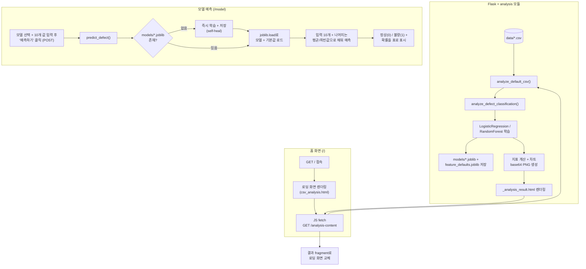

# 사출 데이터 대시보드

Flask + Jinja2 기반 웹 UI로, 사출성형 불량 예측 데이터를 분석하고, 학습된 모델로 새 조건을 입력해 정상/불량을 예측하며, 관련 웹 크롤링 결과를 확인하는 대시보드입니다.

- `pages/`가 아닌 `templates/`에 화면(HTML)을 두고, Jinja2로 파이썬 데이터를 렌더링합니다.
- ML 분석/예측 로직은 `analysis/`, 크롤링 로직은 `crawler/`에 있습니다.
- React/Vue 없이 서버 렌더링 + 최소한의 vanilla JS(fetch, select 전환)만 사용합니다.

## 배포 주소

https://hyundai-autoever-mobility-sw-school.vercel.app/

## 팀 구성

| 이름 | 역할 | 주요 작업 |
| --- | --- | --- |
| 연창, 우린 | 데이터셋 선정 및 모델링 | 사출성형 불량 예측 데이터셋 선정, 데이터 전처리, Logistic Regression / Random Forest 모델 설계·학습·성능 평가 (`analysis/classification.py`, `analysis/defect_classification.py`) |
| 도현 | UI | Flask + Jinja2 기반 전체 화면 설계·구현, 분석 결과 시각화, 모델 예측 화면 UI/UX 개선, 배포 환경 이슈 대응 (`app.py`, `templates/`, `static/`) |
| 상원 | 크롤링 | 사전 검색 기능 구현 — Selenium 기반 네이버 국어사전 크롤링과 국립국어원 언어정보나눔터(온용어) Open API 검색 두 가지 방식 제공 (`crawler/crawler.py`) |

## 화면 구성

| 경로 | 화면 | 설명 |
| --- | --- | --- |
| `/` | 사출 불량 예측 분석 (홈) | 로딩 화면 → `data/`의 기본 CSV로 Logistic Regression / Random Forest를 학습해 데이터 개요·모델 지표·차트·결론을 보여줌 |
| `/analysis-content` | (내부용) | 홈 화면이 fetch로 호출하는 분석 결과 fragment 엔드포인트 |
| `/model` | 모델 예측 | 모델 선택 + 10개 공정 파라미터 입력 → "예측하기" 클릭 시 정상/불량 예측 결과 표시 |
| `/crawl-result` | 사전 검색 | `?source=naver`(Selenium + 네이버 국어사전 크롤링) 또는 `?source=kli`(국립국어원 온용어 Open API)로 단어 검색. `source` 없이 접속하면 두 방식 중 선택하는 화면만 표시 |


## 파일/폴더 역할

| 경로 | 역할 |
| --- | --- |
| `app.py` | Flask 앱 진입점. 라우트(`/`, `/analysis-content`, `/model`, `/crawl-result`) 정의 |
| `requirements.txt` | 의존성 목록 (flask, pandas, scikit-learn, matplotlib, joblib, selenium, python-dotenv) |
| `data/hyundai_autoever_injection_defect_classification_v2.csv` | 사출 불량 예측 원본 데이터셋 (28개 컬럼, 3,500행) |
| `analysis/__init__.py` | 패키지 마커 |
| `analysis/analyzer.py` | 홈 화면용 `analyze_default_csv()`, 예측 화면용 `predict_defect()` 진입점 |
| `analysis/defect_classification.py` | LR/RF 학습, 지표·차트(base64 PNG) 생성, 학습된 모델·피처 기본값을 `models/`에 저장 |
| `analysis/classification.py` | 원래의 Streamlit 프로토타입 원본 (참고용, 현재 Flask 앱에서는 사용하지 않음) |
| `crawler/__init__.py` | 패키지 마커 |
| `crawler/crawler.py` | 사전 검색 로직. `get_crawl_results(keyword, source)`가 `source`에 따라 Selenium 크롤링(`naver`) 또는 온용어 Open API 호출(`kli`)로 분기 |
| `templates/base.html` | 공통 레이아웃 (상단바, 네비게이션) |
| `templates/csv_analysis.html` | 홈 화면 셸 — 로딩 스피너 표시 후 `/analysis-content`를 fetch |
| `templates/_analysis_result.html` | 분석 결과 partial (데이터 개요/모델별 지표·차트/결론 카드). `/analysis-content`가 렌더링해 반환 |
| `templates/model.html` | 모델 예측 화면 (입력 폼 + 결과 표, 2단 레이아웃) |
| `templates/crawl_result.html` | 크롤링 결과 화면 |
| `static/css/style.css` | 전체 공통 스타일시트 (카드, 지표 카드, 차트, 표, 폼 등) |
| `models/` (git 추적 제외) | 학습된 모델(`*.joblib`)과 예측용 피처 기본값. 홈 화면 방문 또는 `/model` 첫 예측 시 자동 생성됨 |
| `.gitignore` | `.venv/`, `__pycache__/`, `models/` 등 추적 제외 목록 |

## 동작 흐름



## 실행 방법

```
python -m venv .venv          # 최초 1회
.venv\Scripts\activate
pip install -r requirements.txt
python app.py
```

브라우저에서 http://localhost:5000 접속 (홈 화면이 자동으로 기본 CSV를 분석합니다).

모델 예측을 써보려면:
1. 상단 메뉴에서 "모델 예측" 클릭
2. 모델 선택 후 10개 공정 파라미터 입력 → "예측하기"

(모델이 아직 학습되지 않은 상태라면 첫 예측 요청에서 자동으로 학습 후 진행되어 몇 초 더 걸릴 수 있습니다.)

사전 검색(`/crawl-result`)을 온용어 Open API(`?source=kli`)로 써보려면, 프로젝트 루트에 `.env` 파일을 만들고 발급받은 인증키를 넣어야 합니다:
```
KLI_API_KEY=발급받은_인증키
```
`?source=naver`(Selenium + 네이버 국어사전)는 로컬에 Chrome이 설치되어 있어야 동작하며, Vercel 등 서버리스 배포 환경에서는 브라우저를 실행할 수 없어 사용할 수 없습니다.

*실행 방법은 위 단계대로 `pip install -r requirements.txt` 파싱, `python app.py` 기동, `/`·`/analysis-content`·`/model`·`/crawl-result`·정적 파일 응답을 직접 재확인했습니다 (모두 200 OK).*
