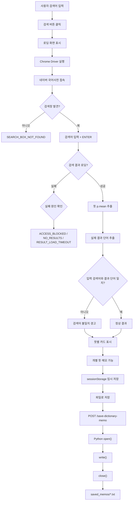

# 사출 데이터 대시보드

Flask + Jinja2 기반 웹 대시보드로, 사출성형 데이터를 분석하고 학습된 머신러닝 모델을 이용해 정상/불량을 예측하며, 네이버 국어사전 크롤링을 통해 관련 용어를 검색할 수 있는 프로젝트입니다.

데이터 분석, 모델 예측, 웹 크롤링을 각각 독립된 기능으로 구성하고 하나의 대시보드에서 사용할 수 있도록 구현했습니다.

주요 기능은 다음과 같습니다.

- 사출성형 데이터 분석
- Logistic Regression / Random Forest 모델 학습
- 신규 공정 조건 정상/불량 예측
- Selenium 기반 네이버 국어사전 검색
- 입력 검색어와 실제 검색 결과 단어 비교
- 크롤링 오류 유형별 안내
- 검색 진행 상태 로딩 화면
- 최근 검색어 관리
- 검색 결과 메모 기능
- Python 파일 입출력을 이용한 TXT 메모 저장

---

## 사용 기술

### Backend

- Python
- Flask
- Jinja2

### 데이터 분석 / 머신러닝

- pandas
- scikit-learn
- Logistic Regression
- Random Forest
- joblib
- matplotlib

### 웹 크롤링

- Selenium
- Chrome
- ChromeDriver

### Frontend

- HTML
- CSS
- Vanilla JavaScript
- Fetch API
- sessionStorage

React 또는 Vue 등의 별도 프론트엔드 프레임워크를 사용하지 않고 Flask 서버 렌더링과 Jinja2를 중심으로 구성했습니다.

---

# 화면 구성

| 경로 | 화면 | 설명 |
| --- | --- | --- |
| `/` | 사출 불량 예측 분석 | 기본 CSV 데이터를 분석하고 모델별 지표와 차트, 분석 결과를 표시 |
| `/analysis-content` | 분석 결과 Fragment | 홈 화면에서 `fetch`로 요청하는 내부 분석 결과 화면 |
| `/model` | 모델 예측 | 공정 조건을 입력하고 학습된 모델을 이용해 정상/불량을 예측 |
| `/crawl-result` | 네이버 국어사전 검색 | Selenium을 이용해 단어를 검색하고 검색 결과와 뜻을 표시 |
| `/save-dictionary-memo` | 메모 파일 저장 | 브라우저에서 선택한 메모를 받아 Python 파일 입출력으로 TXT 파일 생성 |

---

# 프로젝트 구조

```text
project/
│
├─ app.py
├─ requirements.txt
├─ .gitignore
│
├─ analysis/
│   ├─ __init__.py
│   ├─ analyzer.py
│   ├─ defect_classification.py
│   └─ classification.py
│
├─ crawler/
│   ├─ __init__.py
│   └─ crawler.py
│
├─ data/
│   └─ hyundai_autoever_injection_defect_classification_v2.csv
│
├─ models/
│   └─ *.joblib
│
├─ saved_memos/
│   └─ dictionary_memo_YYYYMMDD_HHMMSS.txt
│
├─ templates/
│   ├─ base.html
│   ├─ csv_analysis.html
│   ├─ _analysis_result.html
│   ├─ model.html
│   └─ crawl_result.html
│
└─ static/
    └─ css/
        └─ style.css
```

`saved_memos/` 폴더는 메모 파일을 처음 저장할 때 자동으로 생성됩니다.

---

# 파일 / 폴더 역할

| 경로 | 역할 |
| --- | --- |
| `app.py` | Flask 앱 진입점 및 각 화면의 Route 정의 |
| `requirements.txt` | 프로젝트 실행에 필요한 Python 패키지 |
| `data/` | 사출성형 분석에 사용하는 CSV 데이터 |
| `analysis/__init__.py` | analysis 패키지 설정 |
| `analysis/analyzer.py` | 데이터 분석과 모델 예측을 호출하는 진입점 |
| `analysis/defect_classification.py` | Logistic Regression / Random Forest 학습, 평가 및 차트 생성 |
| `analysis/classification.py` | 기존 분석 코드 또는 참고용 코드 |
| `crawler/__init__.py` | crawler 패키지 설정 |
| `crawler/crawler.py` | Selenium을 이용한 네이버 국어사전 검색 및 오류 처리 |
| `templates/base.html` | 공통 화면 구조 및 네비게이션 |
| `templates/csv_analysis.html` | 사출 데이터 분석 홈 화면 |
| `templates/_analysis_result.html` | 데이터 분석 결과 화면 |
| `templates/model.html` | 모델 예측 화면 |
| `templates/crawl_result.html` | 네이버 국어사전 검색 및 메모 화면 |
| `static/css/style.css` | 프로젝트 공통 CSS |
| `models/` | 학습된 머신러닝 모델 저장 |
| `saved_memos/` | 사용자가 파일 저장 기능을 실행했을 때 생성되는 TXT 메모 |
| `.gitignore` | 가상환경, 캐시, 모델 파일 등 Git 추적 제외 설정 |

---

# 1. 사출 데이터 분석

기본 CSV 데이터를 이용해 사출성형 데이터의 특성을 분석합니다.

분석 과정에서는 다음 머신러닝 모델을 사용합니다.

- Logistic Regression
- Random Forest

분석 결과에서는 다음 정보를 확인할 수 있습니다.

- 데이터 개요
- 모델 성능
- 정확도 등 평가 지표
- 데이터 및 예측 결과 시각화
- 분석 결과에 대한 결론

홈 화면에서는 데이터 분석에 시간이 필요한 것을 고려하여 먼저 로딩 화면을 표시합니다.

이후 JavaScript의 `fetch`를 이용해 `/analysis-content`를 호출하고 분석이 완료되면 결과 화면으로 교체합니다.

---

# 2. 머신러닝 모델 예측

`/model` 화면에서는 사용자가 주요 공정 파라미터를 직접 입력할 수 있습니다.

사용 과정은 다음과 같습니다.

```text
모델 선택
    ↓
공정 파라미터 입력
    ↓
예측하기
    ↓
학습 모델 불러오기
    ↓
예측
    ↓
정상 / 불량 결과 출력
```

학습된 모델은 `models/` 폴더의 `joblib` 파일을 이용합니다.

사용자가 직접 입력하지 않은 피처가 필요한 경우 학습 과정에서 계산한 평균값이나 기본값을 사용하여 예측 입력값을 구성합니다.

---

# 3. 네이버 국어사전 크롤링

`/crawl-result` 화면에서는 Selenium을 이용해 네이버 국어사전에서 단어를 검색합니다.

기본 동작 흐름은 다음과 같습니다.

```text
사용자 검색어 입력
        ↓
Chrome Driver 실행
        ↓
네이버 국어사전 접속
        ↓
검색창 탐색
        ↓
검색어 입력
        ↓
검색 결과 로딩 대기
        ↓
실제 검색 결과 단어 확인
        ↓
뜻 추출
        ↓
Flask
        ↓
Jinja2 화면 렌더링
```

뜻은 네이버 국어사전 검색 결과에서 다음 Selector를 이용해 가져옵니다.

```python
p.mean[lang="ko"]
```

뜻 영역을 기준으로 결과를 읽고, 추가적으로 실제 검색 결과에 표시된 단어를 확인합니다.

---

# 검색 결과 표시 방식

검색 결과는 뜻 하나마다 별도의 카드로 표시됩니다.

예:

```text
┌───────────────────────────────────────────────┐
│ 사출 뜻 1                                     │
│                                               │
│ 첫 번째 뜻 내용                               │
│                                               │
│ 네이버 국어사전                [메모에 추가]  │
└───────────────────────────────────────────────┘

┌───────────────────────────────────────────────┐
│ 사출 뜻 2                                     │
│                                               │
│ 두 번째 뜻 내용                               │
│                                               │
│ 네이버 국어사전                [메모에 추가]  │
└───────────────────────────────────────────────┘
```

각 카드에는 다음 정보가 포함됩니다.

- 실제 검색 결과 단어
- 뜻 번호
- 뜻 내용
- 검색 출처
- 네이버 국어사전 원문 링크
- 메모 추가 버튼

뜻을 하나의 긴 목록으로 표시하지 않고 개별 카드로 구분하여 결과를 쉽게 확인할 수 있도록 구성했습니다.

---

# 검색어와 실제 결과 단어 비교

사용자가 입력한 단어와 네이버 국어사전에서 실제로 표시되는 검색 결과 단어가 다를 수 있습니다.

예:

```text
입력 검색어: 사추
실제 검색 결과: 사출
```

기존에는 검색어와 결과 단어가 다르면 결과를 사용할 수 없는 것으로 처리할 수 있었지만, 실제 검색 결과 자체는 정상적인 경우가 있습니다.

따라서 검색 결과를 삭제하는 대신 사용자에게 차이를 알려주는 방식으로 변경했습니다.

검색어와 실제 결과가 다르면 검색 결과 위에 다음과 같은 경고를 표시합니다.

```text
검색어와 실제 검색 결과 단어가 다릅니다.

입력 검색어: 사추
네이버 국어사전 결과: 사출

아래 내용은 "사출"의 검색 결과입니다.
```

이를 통해 검색 결과는 유지하면서 사용자가 현재 어떤 단어의 뜻을 보고 있는지 확인할 수 있습니다.

---

# 검색 중 로딩 화면

Selenium은 Chrome을 실행하고 외부 웹사이트의 검색 결과가 나타날 때까지 기다려야 하므로 일반적인 페이지 이동보다 시간이 오래 걸릴 수 있습니다.

검색 버튼을 누른 뒤 아무런 화면 변화가 없으면 프로그램이 멈춘 것인지 검색 중인지 구분하기 어렵습니다.

이를 해결하기 위해 검색 요청이 시작되면 로딩 화면을 표시합니다.

```text
네이버 국어사전을 검색하고 있습니다.

검색 결과와 뜻을 가져오는 중입니다.
잠시 기다려주세요.
```

검색 중에는 다음 상태가 적용됩니다.

- 로딩 Spinner 표시
- 검색 버튼 비활성화
- 검색 버튼을 `검색 중...`으로 변경

이를 통해 크롤링이 진행 중이라는 사실을 사용자에게 표시합니다.

---

# 최근 검색어

검색을 반복하는 과정에서 이전 검색어를 다시 입력해야 하는 불편함을 줄이기 위해 최근 검색어 기능을 추가했습니다.

최근 검색어는 최대 5개까지 표시합니다.

기능은 다음과 같습니다.

- 최근 검색어 최대 5개
- 같은 검색어를 다시 검색하면 가장 앞으로 이동
- 최근 검색어 버튼 클릭 시 바로 다시 검색
- 최근 검색어 개별 삭제
- 최근 검색어 전체 삭제

최근 검색 기록은 `sessionStorage`를 사용합니다.

따라서 현재 브라우저 세션에서는 검색 페이지가 다시 로딩되어도 기록을 사용할 수 있지만 브라우저 세션이 종료되면 초기화됩니다.

장기간 검색 기록을 보관하는 목적이 아니라 현재 검색 작업을 보조하기 위한 임시 기능입니다.

---

# 단어 메모장

검색 결과 중 필요한 뜻을 별도로 기록할 수 있도록 메모장 기능을 추가했습니다.

각 결과 카드의 다음 버튼을 이용합니다.

```text
메모에 추가
```

현재 검색 결과를 한 번에 메모하고 싶은 경우 다음 기능을 사용할 수 있습니다.

```text
모든 뜻 메모에 추가
```

메모에는 다음 내용을 기록합니다.

- 검색 결과 단어
- 뜻
- 출처
- 메모한 시간

같은 단어와 같은 뜻이 이미 존재하는 경우 중복해서 추가하지 않도록 처리했습니다.

메모 화면에서는 다음 기능을 제공합니다.

- 개별 메모 추가
- 모든 뜻 메모 추가
- 중복 메모 방지
- 개별 메모 삭제
- 메모 전체 초기화
- TXT 파일 저장

---

# 메모의 임시 저장

화면에 표시되는 메모는 `sessionStorage`를 이용해 현재 브라우저 세션에서만 임시로 관리합니다.

따라서 검색을 계속하는 동안에는 메모가 유지되지만 새로운 브라우저 세션에서는 초기화됩니다.

중요한 메모를 남기고 싶은 경우 `파일로 저장` 기능을 사용합니다.

---

# 메모 파일 저장

메모의 실제 TXT 파일 저장은 Python 파일 입출력 기능을 사용합니다.

수업에서 사용한 다음 방식과 동일한 기본 구조입니다.

```python
file = open(
    "파일이름.txt",
    "w",
    encoding="utf-8"
)

file.write(
    "저장할 내용"
)

file.close()
```

웹 화면에서 `파일로 저장` 버튼을 누르면 현재 메모 목록을 Flask 서버로 전달합니다.

Flask에서는 전달받은 단어와 뜻을 Python의 `open()`, `write()`, `close()`를 이용해 TXT 파일로 기록합니다.

파일은 프로젝트의 다음 폴더에 저장됩니다.

```text
saved_memos/
```

파일명 예:

```text
dictionary_memo_20260827_114500.txt
```

파일 내용 예:

```text
네이버 국어사전 검색 메모
========================================

1. 사출
뜻: 첫 번째 뜻 내용
출처: 네이버 국어사전
저장일시: 2026. 8. 27. 오전 11:40:00
----------------------------------------

2. 금형
뜻: 두 번째 뜻 내용
출처: 네이버 국어사전
저장일시: 2026. 8. 27. 오전 11:42:00
----------------------------------------
```

이 방식은 브라우저에서 직접 파일을 생성하는 방식이 아니라 Python 프로그램이 직접 TXT 파일을 생성하고 내용을 기록하는 방식입니다.

---

# 크롤링 오류 처리

크롤링은 외부 웹사이트와 Chrome을 이용하기 때문에 여러 원인으로 실패할 수 있습니다.

예를 들어 다음과 같은 상황이 존재합니다.

```text
Chrome 실행 실패
네트워크 연결 실패
네이버 접속 실패
검색창을 찾지 못함
검색 결과가 없음
검색 결과 로딩 지연
페이지 구조 변경
자동화 접근 제한
Chrome 연결 종료
```

이러한 상황을 모두 단순히 다음과 같이 처리하면:

```python
except Exception:
    return []
```

사용자 입장에서는 실제 오류와 정상적인 검색 결과 없음 상태를 구분하기 어렵습니다.

따라서 크롤링 실패 원인을 대략적인 유형으로 분류하도록 구성했습니다.

---

# 오류 유형

| 오류 코드 | 설명 |
| --- | --- |
| `EMPTY_KEYWORD` | 검색어가 입력되지 않음 |
| `DRIVER_START_FAILED` | Chrome 또는 ChromeDriver 실행 실패 |
| `SITE_CONNECTION_FAILED` | 네이버 국어사전 접속 실패 |
| `SEARCH_BOX_NOT_FOUND` | 검색창을 찾지 못함 |
| `SEARCH_INPUT_FAILED` | 검색어 입력 또는 검색 실행 실패 |
| `ACCESS_BLOCKED` | 자동화 접근 제한 또는 CAPTCHA 가능성 |
| `NO_RESULTS` | 실제 검색 결과가 존재하지 않음 |
| `RESULT_LOAD_TIMEOUT` | 검색 결과가 제한 시간 안에 나타나지 않음 |
| `DOM_READ_FAILED` | 검색 결과 HTML 요소 읽기 실패 |
| `MEANING_NOT_FOUND` | 검색 페이지는 열렸지만 뜻 영역을 찾지 못함 |
| `BROWSER_COMMUNICATION_FAILED` | Selenium과 Chrome 사이의 연결 문제 |
| `UNEXPECTED_ERROR` | 현재 분류에 포함되지 않은 오류 |

---

# 오류 화면

오류 발생 시 단순한 `에러` 메시지만 출력하지 않고 다음 내용을 제공합니다.

```text
오류 코드
오류 제목
오류 설명
확인해볼 내용
```

예:

```text
RESULT_LOAD_TIMEOUT

검색 결과 로딩 지연

검색은 실행됐지만 제한 시간 안에
검색 결과가 나타나지 않았습니다.

확인해볼 내용
네트워크 또는 페이지 로딩이 지연되었을 수 있으므로
잠시 뒤 다시 시도해주세요.
```

사용자 화면에는 오류 유형과 확인 방법을 간단하게 안내하고, 상세 예외 정보는 서버 로그에 별도로 기록하여 문제 발생 시 원인 추적과 유지보수에 활용할 수 있도록 구성했습니다.

---

# 유지보수 로그

예상하지 못한 오류가 발생한 경우에도 프로그램에서 바로 버리지 않고 다음과 같은 형태로 로그를 남깁니다.

```text
[Crawler 유지보수 로그] 오류종류: 오류내용
```

이를 통해 새로운 문제가 발생했을 때 오류가 발생한 위치와 원인을 확인하고 필요한 경우 새로운 오류 유형을 추가할 수 있도록 구성했습니다.

즉 모든 오류 상황을 미리 예상하는 대신 알려진 오류는 유형별로 분류하고, 알려지지 않은 오류는 로그를 남겨 이후 유지보수가 가능하도록 했습니다.

---

# 부분 실패 처리

크롤링 과정에서 모든 문제가 전체 검색 실패로 이어져야 하는 것은 아닙니다.

예를 들어:

- 실제 결과 단어를 별도로 읽지 못한 경우
- `단어 더보기` 버튼 클릭 실패
- 추가 뜻 로딩 시간 초과

와 같은 경우에도 이미 정상적인 뜻을 확보했다면 결과를 유지합니다.

```text
뜻 검색 성공
     +
부가 기능 실패
     ↓
검색 결과 유지
     +
경고 메시지 표시
```

핵심 검색 기능과 부가 기능을 분리하여 일부 기능에서 문제가 발생해도 사용할 수 있는 검색 결과는 최대한 유지하도록 구성했습니다.

---

# 전체 크롤링 동작 흐름



---

# 전체 프로젝트 동작 흐름

```mermaid
flowchart TD

    CSV[("data/*.csv")]

    subgraph Analysis["사출 데이터 분석"]

        A["GET /"]
        --> B["csv_analysis.html"]

        B --> C["GET /analysis-content"]

        C --> D["analyze_default_csv()"]

        CSV --> D

        D --> E["데이터 전처리"]

        E --> F["Logistic Regression"]

        E --> G["Random Forest"]

        F --> H["모델 평가"]

        G --> H

        H --> I["차트 생성"]

        I --> J["_analysis_result.html"]

    end


    subgraph Predict["모델 예측"]

        P1["GET /model"]
        --> P2["공정 조건 입력"]

        P2 --> P3["예측하기"]

        P3 --> P4["학습 모델 로드"]

        P4 --> P5["정상 / 불량 예측"]

        P5 --> P6["예측 결과 표시"]

    end


    subgraph Crawl["네이버 국어사전"]

        C1["GET /crawl-result"]
        --> C2["Selenium 검색"]

        C2 --> C3["뜻 추출"]

        C3 --> C4["결과 단어 확인"]

        C4 --> C5["뜻별 카드 표시"]

        C5 --> C6["메모"]

        C6 --> C7["TXT 파일 저장"]

    end
```



---

# 문제 해결 과정

## 문제 1. 검색 결과가 사라지는 문제

### 문제 인식

검색어와 실제 검색 결과 단어를 비교하는 기능을 추가하면서 기존에 정상적으로 나오던 검색 결과까지 표시되지 않는 문제가 발생했습니다.

화면 자체의 문제인지 확인하기 위해 다음 데이터 흐름을 기준으로 문제를 확인했습니다.

```text
검색어 입력
→ Selenium 검색
→ HTML 요소 탐색
→ Python 결과
→ Flask
→ Jinja2
→ 브라우저
```

### 원인

검색 결과 단어를 찾기 위한 특정 XPath와 검색어 정확 일치 조건이 추가되면서 부가적인 단어 판독에 실패한 경우 정상적인 뜻까지 폐기되고 있었습니다.

### 해결

정상적으로 동작하던:

```python
p.mean[lang="ko"]
```

기반 뜻 추출을 핵심 기능으로 유지했습니다.

실제 결과 단어 추출은 별도의 보조 기능으로 분리했습니다.

결과 단어 추출에 실패하더라도 이미 확보한 뜻은 유지하고 입력 검색어를 대신 사용하도록 처리했습니다.

### 결과

결과 단어 판독과 뜻 검색을 분리하여 부가 기능의 실패 때문에 전체 검색 결과가 사라지는 문제를 줄였습니다.

---

## 문제 2. 검색어와 결과 단어가 다른 문제

### 문제 인식

사용자가 입력한 검색어와 네이버 국어사전에 실제로 표시된 결과 단어가 다를 수 있었습니다.

검색 결과를 그대로 표시하면 사용자가 어떤 단어의 뜻을 보고 있는지 혼동할 수 있었습니다.

### 해결

입력 검색어와 실제 검색 결과 단어를 각각 저장하고 비교했습니다.

두 값이 다른 경우 결과를 삭제하지 않고 검색 결과 카드 위에 빨간 경고를 표시했습니다.

### 결과

검색 결과는 유지하면서 사용자가 현재 표시된 뜻이 어떤 단어의 결과인지 확인할 수 있게 되었습니다.

---

## 문제 3. 검색 중 화면이 멈춘 것처럼 보이는 문제

### 문제 인식

Selenium 검색에는 시간이 필요하지만 기존 화면에서는 검색 버튼을 누른 후 아무런 상태 변화가 나타나지 않았습니다.

### 해결

검색 시작 시 다음 UI를 표시했습니다.

- 전체 화면 로딩창
- 로딩 Spinner
- `검색 중...` 버튼
- 검색 버튼 비활성화

### 결과

사용자가 프로그램이 멈춘 상태와 검색이 진행 중인 상태를 구분할 수 있게 되었습니다.

---

## 문제 4. 모든 오류가 같은 형태로 처리되는 문제

### 문제 인식

서로 다른 원인의 오류가 모두 빈 검색 결과와 동일하게 처리되면 문제 발생 원인을 확인하기 어렵습니다.

### 해결

크롤링 실패 단계를 기준으로 오류 코드를 분류했습니다.

```text
Chrome 실행
사이트 접속
검색창 탐색
검색 실행
검색 결과 로딩
뜻 추출
브라우저 통신
```

각 단계의 실패에 별도의 오류 코드와 설명을 연결했습니다.

분류되지 않은 오류는 `UNEXPECTED_ERROR`로 처리하고 상세 내용은 유지보수 로그에 기록합니다.

### 결과

사용자 화면에서 대략적인 문제 원인을 확인할 수 있고, 상세 오류는 서버 로그를 이용해 이후 원인 분석과 유지보수에 사용할 수 있게 되었습니다.

---

## 문제 5. 검색 결과 가독성 문제

### 문제 인식

여러 뜻을 하나의 큰 결과 상자 안에 표시하면 각각의 뜻을 구분하기 어렵다고 판단했습니다.

### 해결

뜻 하나를 하나의 결과 단위로 보고 다음 형태의 개별 카드로 구성했습니다.

```text
단어 + 뜻 번호
뜻 내용
출처
메모 추가 버튼
```

### 결과

뜻을 빠르게 구분할 수 있고 필요한 뜻만 선택하여 메모할 수 있게 되었습니다.

---

## 문제 6. 반복 검색의 불편함

### 문제 인식

이전에 검색했던 단어를 다시 검색할 때 매번 직접 입력해야 했습니다.

### 해결

현재 브라우저 세션 동안 최근 검색어를 최대 5개까지 관리하도록 했습니다.

최근 검색어 버튼을 누르면 해당 단어를 즉시 다시 검색합니다.

### 결과

반복적인 검색 과정에서 같은 검색어를 다시 입력해야 하는 작업을 줄였습니다.

---

## 문제 7. 필요한 검색 결과를 기록하기 어려운 문제

### 문제 인식

검색 결과 중 필요한 뜻을 다른 프로그램에 직접 복사해야 하는 불편함이 있었습니다.

### 해결

검색 결과 카드마다 메모 추가 버튼을 제공하고 별도의 메모 영역을 구성했습니다.

메모 내용은 검색 중에는 `sessionStorage`로 임시 관리합니다.

중요한 메모는 Python의 파일 입출력 기능을 이용하여 TXT 파일로 저장할 수 있도록 구현했습니다.

### 결과

검색 → 결과 확인 → 필요한 뜻 선택 → 메모 → TXT 저장 과정까지 하나의 화면에서 처리할 수 있게 되었습니다.

---

# 실행 방법

## 1. 가상환경 생성

Windows 기준:

```bash
python -m venv .venv
```

---

## 2. 가상환경 활성화

```bash
.venv\Scripts\activate
```

---

## 3. 필요한 패키지 설치

```bash
pip install -r requirements.txt
```

Selenium이 `requirements.txt`에 없다면 다음 패키지도 설치합니다.

```bash
pip install selenium
```

---

## 4. Flask 실행

```bash
python app.py
```

---

## 5. 브라우저 접속

```text
http://localhost:5000
```

---

# 모델 예측 사용 방법

처음 실행한 경우 먼저 홈 화면에서 데이터 분석과 모델 학습을 완료해야 합니다.

```text
서버 실행
    ↓
홈 화면 접속
    ↓
CSV 분석
    ↓
모델 학습
    ↓
models/*.joblib 생성
    ↓
모델 예측 화면
    ↓
공정 파라미터 입력
    ↓
예측하기
```

---

# 네이버 국어사전 검색 사용 방법

```text
크롤링 결과 화면 접속
    ↓
검색어 입력
    ↓
검색
    ↓
로딩 화면
    ↓
네이버 국어사전 검색
    ↓
결과 단어 및 뜻 확인
    ↓
필요한 뜻 메모
    ↓
파일로 저장
```

---

# Chrome 화면 확인 방법

기본 설정에서는 Headless Chrome을 사용할 수 있습니다.

```python
options.add_argument(
    "--headless=new"
)
```

크롤링 과정을 직접 확인하고 싶은 경우 해당 코드를 주석 처리합니다.

```python
# options.add_argument(
#     "--headless=new"
# )
```

그러면 Selenium이 실제 Chrome 창을 표시하며 검색을 진행합니다.

페이지 구조 변경이나 접근 제한 여부를 직접 확인할 때 사용할 수 있습니다.

---

# 주의사항

## Chrome

크롤링 기능을 사용하려면 Chrome이 설치되어 있어야 합니다.

Chrome 또는 Selenium 환경에 문제가 있는 경우 다음 오류가 발생할 수 있습니다.

```text
DRIVER_START_FAILED
BROWSER_COMMUNICATION_FAILED
```

---

## 네이버 국어사전 HTML 구조

크롤링은 현재 네이버 국어사전의 HTML 요소를 기준으로 구현되어 있습니다.

네이버에서 페이지 구조를 변경하면 다음과 같은 오류가 발생할 수 있습니다.

```text
SEARCH_BOX_NOT_FOUND
MEANING_NOT_FOUND
RESULT_LOAD_TIMEOUT
```

이 경우 `crawler/crawler.py`의 Selector를 확인해야 합니다.

---

## 자동화 접근 제한

짧은 시간에 많은 검색 요청을 보내면 웹사이트에서 자동화된 접근으로 판단할 수 있습니다.

이 경우 다음 오류로 분류될 수 있습니다.

```text
ACCESS_BLOCKED
```

필요한 경우 Headless 모드를 해제하고 실제 Chrome 화면을 확인합니다.

---

## 최근 검색어와 화면 메모

최근 검색어와 아직 파일로 저장하지 않은 메모는 `sessionStorage`를 이용합니다.

현재 브라우저 세션에서는 유지되지만 새로운 브라우저 세션에서는 초기화됩니다.

중요한 메모는 `파일로 저장` 버튼을 이용해 TXT 파일로 저장해야 합니다.

---

## TXT 파일

`파일로 저장` 버튼을 누르면 Python이 다음 위치에 파일을 생성합니다.

```text
saved_memos/
```

이 기능은 로컬 Flask 서버를 실행하는 환경을 기준으로 합니다.

---

# 프로젝트 설계 특징

## 핵심 기능과 보조 기능 분리

실제 검색 결과 단어를 찾지 못하거나 추가 뜻을 불러오지 못하더라도 이미 정상적으로 가져온 뜻은 유지하도록 구성했습니다.

---

## 오류 유형 분류

모든 오류를 하나의 `Exception`으로 처리하지 않고 크롤링 과정의 단계별로 오류를 구분했습니다.

---

## 유지보수 로그

화면에는 사용자가 이해할 수 있는 오류 설명을 표시하고 상세 예외 내용은 서버 로그에 기록합니다.

이를 통해 동일한 문제가 반복될 경우 로그를 확인하여 원인을 추적하고 필요한 오류 처리를 추가할 수 있습니다.

---

## 검색 결과 검증

입력 검색어와 실제 검색 결과 단어가 다를 경우 결과를 삭제하지 않고 차이를 사용자에게 경고합니다.

---

## 사용자 상태 표시

검색 시간이 길어지는 경우 로딩 화면을 표시하여 현재 검색이 진행 중임을 알 수 있도록 했습니다.

---

## 반복 작업 보조

최근 검색어와 메모 기능을 통해 반복 검색과 필요한 정보 기록 과정을 줄였습니다.

---

# 향후 개선 가능 사항

현재 구조에서 추가로 개선할 수 있는 기능은 다음과 같습니다.

- `crawl_result.html`의 CSS를 `static/css/style.css`로 분리
- JavaScript를 별도의 `static/js/` 파일로 분리
- 크롤링 결과 캐시 적용
- 검색 요청 간 시간 간격 설정
- 네이버 HTML 구조 변경에 대비한 Selector 추가
- 크롤링 기능 테스트 코드 작성
- 메모 CSV 저장 기능
- 메모 파일명 직접 입력 기능
- 서버 메모 파일 목록 조회
- Flask Blueprint를 이용한 기능별 Route 분리

---

# 요약

이 프로젝트는 다음 세 기능을 하나의 Flask 대시보드로 구성한 프로젝트입니다.

```text
사출 데이터 분석
        +
머신러닝 불량 예측
        +
네이버 국어사전 검색
```

특히 크롤링 기능은 단순히 웹페이지에서 텍스트를 가져오는 것에서 끝나지 않고 다음 흐름으로 구성했습니다.

```text
검색어 입력
    ↓
검색 진행 상태 표시
    ↓
Selenium 검색
    ↓
실제 결과 단어 확인
    ↓
검색어와 결과 비교
    ↓
뜻별 결과 카드 표시
    ↓
오류 원인 분류
    ↓
최근 검색어
    ↓
메모
    ↓
Python TXT 파일 저장
```

외부 웹사이트를 이용하는 크롤링 특성상 발생할 수 있는 다양한 실패 상황을 고려하여 오류 유형을 분류하고 유지보수 로그를 남기도록 했으며, 검색 결과를 확인한 뒤 필요한 정보를 기록하고 파일로 저장할 수 있도록 기능을 확장했습니다.
