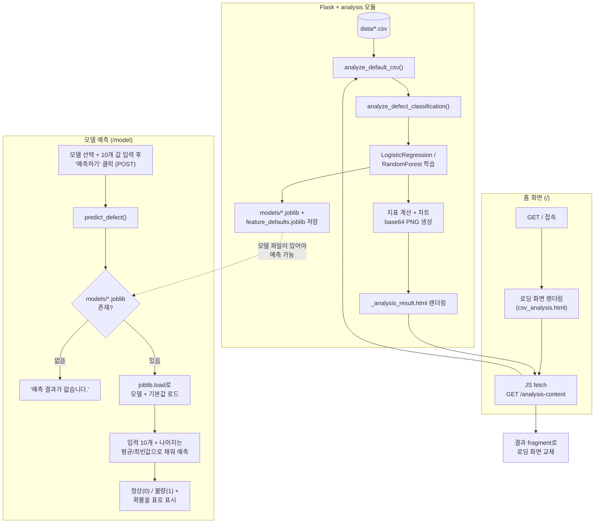

# 사출 데이터 대시보드

Flask + Jinja2 기반 웹 UI로, 사출성형 불량 예측 데이터를 분석하고, 학습된 모델로 새 조건을 입력해 정상/불량을 예측하며, 관련 웹 크롤링 결과를 확인하는 대시보드입니다.

- `pages/`가 아닌 `templates/`에 화면(HTML)을 두고, Jinja2로 파이썬 데이터를 렌더링합니다.
- ML 분석/예측 로직은 `analysis/`, 크롤링 로직은 `crawler/`에 있습니다.
- React/Vue 없이 서버 렌더링 + 최소한의 vanilla JS(fetch, select 전환)만 사용합니다.

## 배포 주소

https://hyundai-autoever-mobility-sw-school.vercel.app/

## 팀 구성

| 이름 | 역할 |
| --- | --- |
| 연창, 우린 | 데이터셋 선정 및 모델링 |
| 도현 | UI |
| 상원 | 크롤링 |

## 화면 구성

| 경로 | 화면 | 설명 |
| --- | --- | --- |
| `/` | 사출 불량 예측 분석 (홈) | 로딩 화면 → `data/`의 기본 CSV로 Logistic Regression / Random Forest를 학습해 데이터 개요·모델 지표·차트·결론을 보여줌 |
| `/analysis-content` | (내부용) | 홈 화면이 fetch로 호출하는 분석 결과 fragment 엔드포인트 |
| `/model` | 모델 예측 | 모델 선택 + 10개 공정 파라미터 입력 → "예측하기" 클릭 시 정상/불량 예측 결과 표시 |
| `/crawl-result` | 크롤링 결과 | 사출 관련 뉴스 크롤링 결과 (현재 `crawler/crawler.py`는 빈 리스트를 반환하는 스텁) |

## 파일/폴더 역할

| 경로 | 역할 |
| --- | --- |
| `app.py` | Flask 앱 진입점. 라우트(`/`, `/analysis-content`, `/model`, `/crawl-result`) 정의 |
| `requirements.txt` | 의존성 목록 (flask, pandas, scikit-learn, matplotlib, joblib) |
| `data/hyundai_autoever_injection_defect_classification_v2.csv` | 사출 불량 예측 원본 데이터셋 (28개 컬럼, 3,500행) |
| `analysis/__init__.py` | 패키지 마커 |
| `analysis/analyzer.py` | 홈 화면용 `analyze_default_csv()`, 예측 화면용 `predict_defect()` 진입점 |
| `analysis/defect_classification.py` | LR/RF 학습, 지표·차트(base64 PNG) 생성, 학습된 모델·피처 기본값을 `models/`에 저장 |
| `analysis/classification.py` | 원래의 Streamlit 프로토타입 원본 (참고용, 현재 Flask 앱에서는 사용하지 않음) |
| `crawler/__init__.py` | 패키지 마커 |
| `crawler/crawler.py` | 크롤링 결과 조회 함수 (팀원 파트, 현재 빈 리스트 반환하는 스텁) |
| `templates/base.html` | 공통 레이아웃 (상단바, 네비게이션) |
| `templates/csv_analysis.html` | 홈 화면 셸 — 로딩 스피너 표시 후 `/analysis-content`를 fetch |
| `templates/_analysis_result.html` | 분석 결과 partial (데이터 개요/모델별 지표·차트/결론 카드). `/analysis-content`가 렌더링해 반환 |
| `templates/model.html` | 모델 예측 화면 (입력 폼 + 결과 표, 2단 레이아웃) |
| `templates/crawl_result.html` | 크롤링 결과 화면 |
| `static/css/style.css` | 전체 공통 스타일시트 (카드, 지표 카드, 차트, 표, 폼 등) |
| `models/` (git 추적 제외) | 학습된 모델(`*.joblib`)과 예측용 피처 기본값. 홈 화면을 한 번 이상 열어야 생성됨 |
| `.gitignore` | `.venv/`, `__pycache__/`, `models/` 등 추적 제외 목록 |

## 동작 흐름



> **주의**: `/model`에서 예측하려면 `models/`에 학습된 모델 파일이 있어야 합니다. 서버를 새로 띄운 직후라면 먼저 홈 화면(`/`)을 한 번 열어 분석(=학습)을 완료해야 예측이 동작합니다. 학습 전에 예측을 시도하면 오류 없이 "예측 결과가 없습니다."로 표시됩니다.

## 실행 방법

```
python -m venv .venv          # 최초 1회
.venv\Scripts\activate
pip install -r requirements.txt
python app.py
```

브라우저에서 http://localhost:5000 접속 (홈 화면이 자동으로 기본 CSV를 분석합니다).

모델 예측을 써보려면:
1. 홈 화면 분석이 끝날 때까지 기다린 뒤 (최초 1회, 모델 학습으로 몇 초 소요)
2. 상단 메뉴에서 "모델 예측" 클릭
3. 모델 선택 후 10개 공정 파라미터 입력 → "예측하기"

*실행 방법은 위 단계대로 `pip install -r requirements.txt` 파싱, `python app.py` 기동, `/`·`/analysis-content`·`/model`·`/crawl-result`·정적 파일 응답을 직접 재확인했습니다 (모두 200 OK).*
